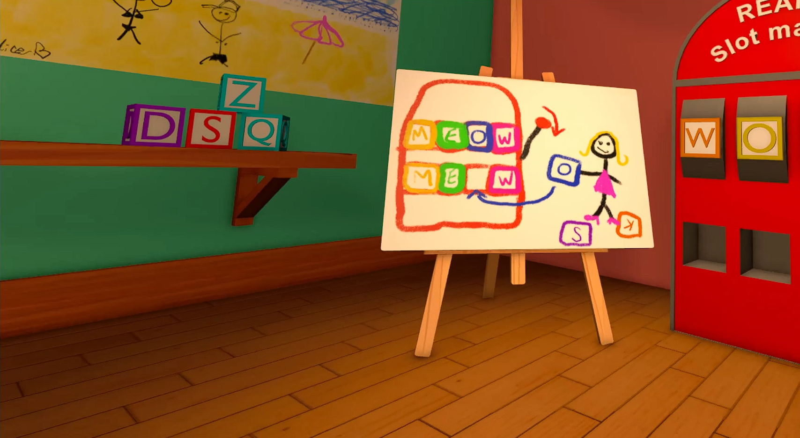
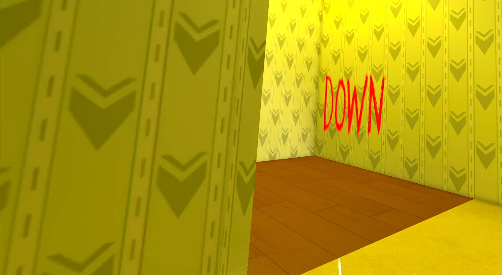
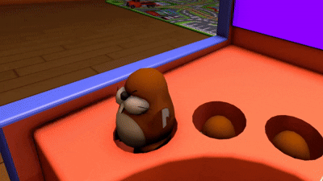

<!--Rappel push 07/02 sur la distance de grab. Le paramètre c'est XR Interaction Setup/XR Origin/Left Controller/Ray Interactor/XR Ray Interactor/Raycast Configuration/Max Raycast Distance-->

# Baby Steps

Un jeu en réalité virtuelle où vous incarnez un enfant dans une garderie transformée en centre de test, guidé par une intelligence artificielle.

<p float="left">
    
    
</p>

## Captures d'écran

<p float="left">
  
  
</p>

<p align="center">
    
</p>

## Fonctionnalités

- Deux salles
- Cinq mini-jeux

## Exécuter localement

Clonez le projet

```bash
  git clone https://github.com/pgmtx/reamix_2025/
```

Puis ouvrez le projet sur Unity Hub avec l'éditeur en version **2022.3.9f1**
